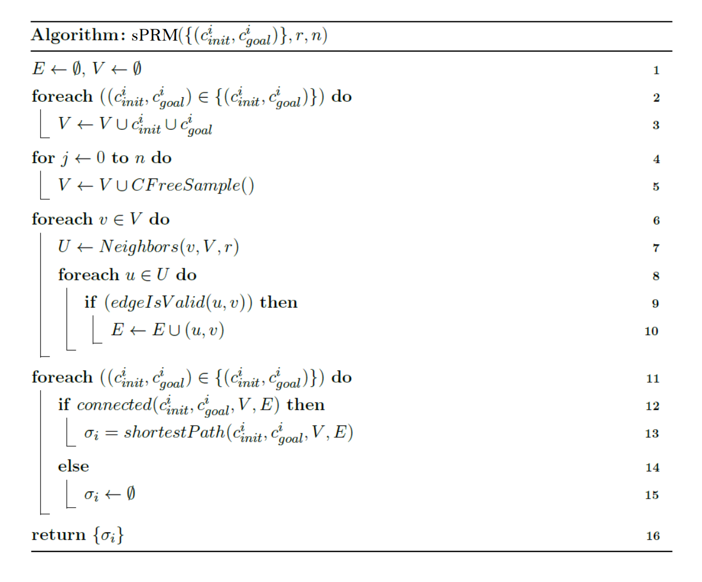

# Motion Planning Application

This project is created from a python template for testing out some Motion Planning Algorithms. The template was created
with Python `3.7.8`.

The template was extended and updated with improvements to the template and the algorithms itself. The development was
done with Python `3.10.3` and the [dependencies](requirements.txt) were updated to this state.

### Description

This project was created within a lecture of __Datastructures and Algorithms__. It implements several functions like
__Collision Detection__ and __Motion Planning__ with calculations in the several spaces.

## Installation

You should create a virtual environment (`venv`) and install the required packages with the following commands:

Windows:

```shell
python -m venv env
.\env\Scripts\activate    
(env) $ pip install -r requirements.txt
```

Linux:

```shell
python3 -m venv env
source env/bin/activate
(env) $ pip install -r requirements.txt
```

## Run

In order to run it makes sure that your `venv` is installed.

Windows:

```shell
.\env\Scripts\activate 
(env) $ python app.py
```

Linux:

```shell
source env/bin/activate
(env) $ python app.py
```

## Architecture

```
              app.py
                |
    ------- controller ----------   
    |           |               |
workspace   configspace   collisionspace
```

<details>
  <summary>Explanation</summary>

* [app.py](app.py) = start the application and the UI
* [controller.py](controller.py) = manages all the spaces below
* [workspace.py](workspace.py) = handles graphical display of algorithms and collision-detection
* [configspace.py](configspace.py) = handles the motion-planning algorithms
* [collisionspace.py](collisionspace.py) = calculates and shows collision-space

</details>

## Algorithms

### Simplified Probabilistic RoadMaps (sPRM)

Category: Sampling-based Motion Planner



<details>
  <summary>Explanation</summary>

|            Input             | Explanation                                  |
|:----------------------------:|:---------------------------------------------|
| c<sup>i</sup><sub>init</sub> | Start points for single or multiple queries. |
| c<sup>i</sup><sub>goal</sub> | End points for single or multiple queries.   |
|              r               | Search radius in the algorithm.              |
|              n               | Amount of samples that are created.          |

__Note:__ The parameters r and n are completely independent and should be small for good performance, but not too small
for no solution. The best parameters are never known.

| Datastructure | Explanation                              | Interpretation       |
|:-------------:|:-----------------------------------------|:---------------------|
|       E       | edge data between two configurations     | List<(Point, Point)> |
|       V       | vertex data for all configurations       | List<Point>          |
|       U       | temporary neighbour data of a vertex     | List<Point>          |
| σ<sub>i</sub> | shortest path data for a configuration i | List<(Point, Point)> |

| Pseudocode Line | Explanation                                                                                                                                                     |
|:---------------:|:----------------------------------------------------------------------------------------------------------------------------------------------------------------|
|     2 and 3     | All start (c<sup>i</sup><sub>init</sub>) and goal (c<sup>i</sup><sub>goal</sub>) configurations are added into the vertex structure (V).                        |
|     4 and 5     | Computation of `CFreeSample()` with the amount of defined samples (n).                                                                                          |
|        7        | Computation of `Neighbors(v,V,r)` for each vertex in the defined radius (r).                                                                                    |
|     8 to 10     | Computation of `edgeIsValid(u,v)`. The valid edges get added into the valid edge structure (E). Filled E characterizes the traversable area (C<sub>free</sub>). |
|       11        | Loop enables multiple queries.                                                                                                                                  |
|       12        | Computation of `connected(...)` between start and goal.                                                                                                         |
|       13        | Computation of `shortestPath(...)` with a [Dijkstra Algorithm](https://en.wikipedia.org/wiki/Dijkstra%27s_algorithm).                                           |

__Note:__ The blocked area (C<sub>obs</sub>) is ignored in the computation of `CFreeSample()`. In the computation
of `Neighbors(v,V,r)` some vertexes (v) could be ignored because of a too small radius (r), but if r is too large, the
edge connection has quadratic complexity (O<sup>2</sup>). The computation of `Neighbors(v,V,r)` and `edgeIsValid(u,v)`
take the most performance. Parallelization of the lines 4 to 10 bring a high benefit in performance because there are
many independent calculations.

</details>